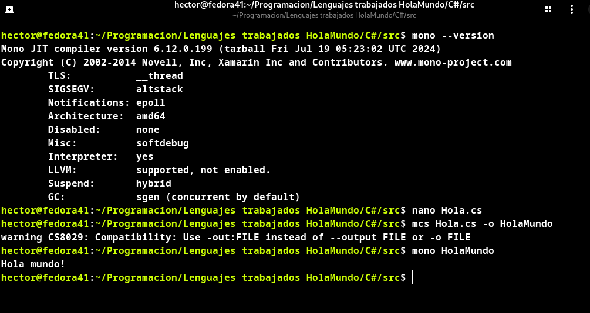

# C# [](https://skillicons.dev)
## Un poco de historia 📚
**C#** o **C Sharp** es un lenguaje de programación publicado en el año **2000** por un equipo formado por [**Anders Hejlsberg**](https://es.wikipedia.org/wiki/Anders_Hejlsberg) para Microsoft, para dotar de orientación a objetos a la plataforma **.NET**.  
Su sintaxis deriva de **C** y **C++** y utiliza el modelo de objetos similar al de **Java**.  
Como curiosidad, el simbolo **# o sharp**, se traduce en notación musical como sostentido, es decir, que la nota en cuestión debe sonar un semitono más alta que su versión normal(su predecesor **C++** en este caso). Es una metafora de la superioridad de **C#** sobre **C++**. Además, en simbolo **#** puede ser imaginado como cuatro simnbolos **+**.  

## Sobre Anders Hejlsberg :man:
[**Anders Hejlsberg**](https://es.wikipedia.org/wiki/Anders_Hejlsberg) nació el 2 de Diciembre de 1960 en Copenhague, Dinamarca. Estudió ingeniería en la Universidad Técnica de Dinamarca, pero no se graduó.  
Mientras estaba en la universidad, con aproximadamente 20 años, empezó a desarrollar programas para el microordenador [**Nascom**](https://en.wikipedia.org/wiki/Nascom), incluyendo un compilador de Pascal al que llamó ***Blue Label Pascal compiler***. Este proyecto lo llevo a fundar junto a algunos amigos **PolyData**, una pequeña empresa que comercializaba su software. Pronto reescribiría su compilador para adaptarlo a **CP/M** y **MS-DOS** y lo concedió bajo licencia a la empresa [**Borland**](https://es.wikipedia.org/wiki/Borland). Junto a otras herramientas de programación su compilador pasó a convertirse en el sistema **Turbo Pascal**.  
En 1989 PolyData enfrentó dificultades comerciales y Anders se trasladó a California como ingeniero jefe en Borland, donde permaneció hasta 1996. En este periodo desarrollo más profundamente **Turbo Pascal** y el sustituto de este, **Turbo Delphi**.  

Por su talento Anders se convirtió en objetivo de **Microsoft**, y tras una serie de ofertas que **Borland** no pudo igualar, Anders abandonó a esta última y pasó a ser parte del equipo de Microsoft. Uno de sus primeros logros fue el lenguaje de programación **J++**, hoy día descontinuado.  
Fue en el año 1999 cuando Anders formó un equipo con el objetivo de desarrollar un lenguaje orientado a objetos para la plataforma **.NET** de Microsoft, **C#** o **C sharp**. Publicado en el año 2000.  

En 2012 compenzó a trabajar en un nuevo proyecto, el lenguaje de programación **TypeScript**, en el que sigue trabajando a día de hoy.  

Anders Hejlsberg ha ganado varios premios, entre ellos:  
 - *Premio a la excelencia en programación DR. Dobb's, 2001*.  
 - *Premio de Reconocimiento Técnico de Microsoft, 2007*(compartido con su equipo).  
 


 
## Hola mundo! 🖖
Vamos a hacer nuestro "Hola mundo" desde la terminal. En esta ocasion el compilador para **C#** no viene instalado por defecto en Fedora, quizas en Windows si al ser un lenguaje creado por Microsoft. Podemos instalarlo con el siguiente comando, segun el gestor de paquetes de cada distro:  
```
sudo (dnf/apt/yum/pacman) install mono
```  
Con esto ya podemos programar y compilar nuestro **"Hola mundo!"** en **C#**.   
A continuación crearemos un archivo de texto con extension ***.cs***:  
```
nano Hola.cs
```
Y escribimos el siguiente código:  
```
using System;
public class Hola {
	public static void Main(string[] args) {
		Console.WriteLine("Hola mundo!");
	}
}
```
Ahora compilamos con **msc** y le damos nombre:  
```
msc Hola.cs -o HolaMundo
```
Ya podemos ejecutar nuestro programa!:
```
./HolaMundo
```
Resultado:  


## Requisitos
-Ordenador  
-Editor de textos  
-Mono instalado en el sistema operativo  
## Autor 👨‍🎓
**Héctor Monroy Fuertes** - Estudiante de DAM. 

