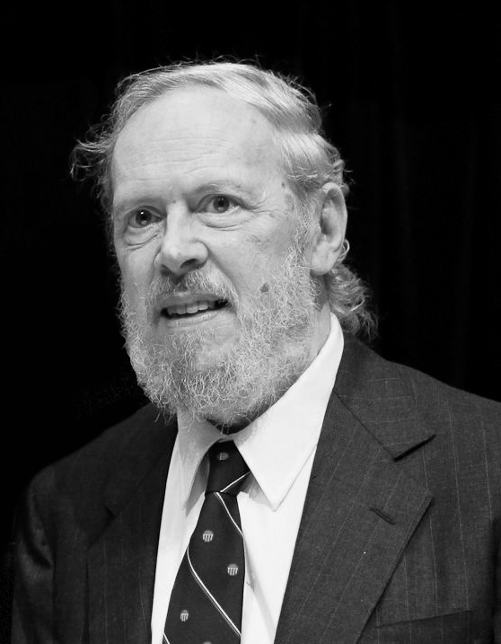

# C [](https://skillicons.dev)
## Un poco de historia 📚
**C** es un lenguaje de programación creado entre **1969** y **1973** en los Laboratorios Bell por [**Dennis Ritchie**](https://es.wikipedia.org/wiki/Dennis_Ritchie), como una evolucion de **B**.  
Es un lenguaje orientado a su implementación en sistemas operativos Unix, debido a que dispone de de estructuras tipicas de lenguajes de alto nivel, pero, al mismo tiempo, tambien dispone de estructuras de bajo nivel que permiten mezclar codigo **C** con **Ensamblador** y acceder directamente a memoria o perifericos.  
 
## Sobre Dennis Ritchie :man:
[**Dennis MacAlistair Ritchie**](https://es.wikipedia.org/wiki/Dennis_Ritchie) nació el 9 de Septiembre de 1941 en Bronxville, Nueva York. Desde niño mostró gran interés por la ciencia y la tecnología, influenciado por su padre, Alistair Ritchie, el cual fue un destacado físico. Cursó la secundaria en el Instituto de Tecnología de Nueva Jersey, donde desarrolló su gran pasión por las matematicas y la programación. Años más tarde, en 1963, se licenció en física por la Universidad de Harvard, donde también obtendría un master en ciencias aplicadas.  

En 1967 comenzó su carrera en los Laboratorios Bell, donde su padre trabajaba. El primer proyecto en que trabajó junto a **Ken Thompson** fue **Multics**, uno de los primeros sistemas operativos desarrollados. Thompson encontró por aquel entonces una minicomputadora [**PDP-7**](https://es.wikipedia.org/wiki/PDP-7) para la que desarrolló junto a Ritchie y otros, sus propios programas y sistema operativo. Fue así como nació **UNIX**. Para complementar el lenguaje ensamblador utilizado, Thompson desarrolló **B**. Fue entonces, entre **1969** y **1972** cuando Dennis desarrolló **C**, como una evolución de B.  
Dennis Ritchie continuó trabajando en diferentes proyectos en los Laboratios Bell hasta su jubilación en 2007.  
Dennis Ritchie obtuvo varios premios a lo largo de su vida. Algunos de estos son:  
 - *Premio NEC de la fundacion C&C, 1979.*  
 - *IEEE Emmanuel Piore Award, 1982.*  
 - *Bell Laboratories Fellow, 1983.*  
 - *Premio Turing, 1983*  
 - *Medalla Nacional de Tecnología, 1999.*  
 - *Premio de Japón, 2011.*  
 También es autor de varios libros, como:  
 - *El lenguaje de programación C, 1978(junto con Brian Kernighan).*  
 - *Unix Programmer's Manual, 1971.*  
 
 Dennis Ritchie fue hallado muerto el 12 de Octubre de 2011 en su casa de Berkeley Heights , a la edad de 70 años.  
 
## Hola mundo! 🖖
Vamos a hacer nuestro "Hola mundo" desde la terminal. En Fedora **gcc**, el compilador para **C**, viene instalado por defecto. Podemos comprobarlo con:  
```
gcc --version
```
Nos dará un resultado así, si lo tenemos instalado:  
  
Hecho esto ya podemos programar nuestro "Hola mundo" en C. Crearemos un archivo de texto con extension ***.c***:  
```
nano Hola.c
```
Y escribimos el siguiente código:
```
#include <stdio.h>
int main() {
	printf("Hola mundo!\n");
	return 0;
}
```
Ahora compilamos y le damos nombre:  
```
gcc Hola.c -c HolaMundo
```
Ya podemos ejecutar nuestro programa!:
```
./HolaMundo
```
Resultado:  


## Requisitos
-Ordenador  
-Editor de textos  
-Gcc instalado en el sistema operativo
## Autor 👨‍🎓
**Héctor Monroy Fuertes** - Estudiante de DAM. 

